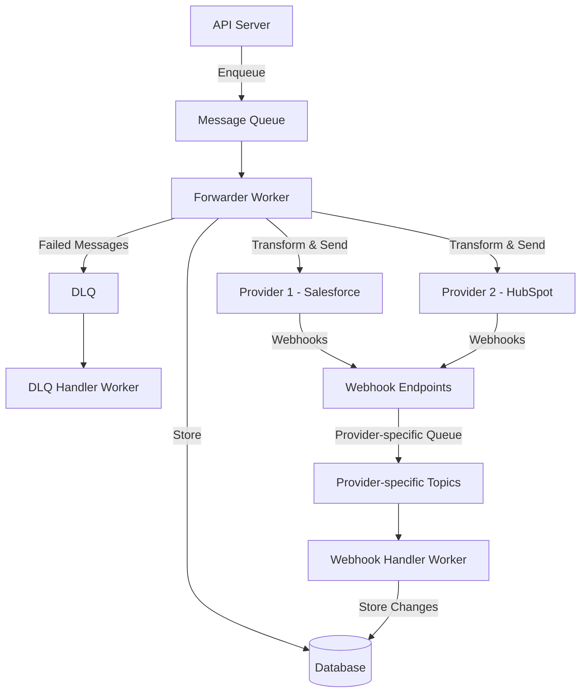

# SyncRoot

SyncRoot is a data synchronization service that allows you to manage contacts across multiple CRM providers such as Salesforce and HubSpot. It provides a unified API to create, read, update, and delete contacts, and ensures data consistency across all connected providers.

## Table of Contents

- [Overview](#overview)
- [Architecture](#architecture)
- [Features](#features)
- [Components](#components)
- [API Endpoints](#api-endpoints)
- [Request Flow](#request-flow)
- [Getting Started](#getting-started)
- [Development](#development)
- [Deployment](#deployment)

## Overview

SyncRoot acts as a middleware between your application and various CRM providers. When you create, update, or delete a contact through SyncRoot's API, the system ensures that the changes are propagated to all connected providers, handling the necessary data transformations and API calls.

## Architecture

The architecture of SyncRoot follows a message-driven approach with separate components for API handling, message processing, and provider integration.



## Features

- CRUD operations for contacts
- Synchronization with multiple CRM providers (Salesforce, HubSpot)
- Message-based architecture for reliability and scalability
- Dead-letter queue (DLQ) for handling failed messages
- Webhook support for receiving updates from providers
- Configurable via environment variables

## Components

### API Server

Exposes RESTful endpoints for managing contacts and other resources.

### Workers

- **Forwarder Worker**: Processes messages from the queue, stores data in the database, and forwards to providers
- **DLQ Handler Worker**: Processes failed messages from the Dead-Letter Queue
- **Webhook Handler Worker**: Processes webhooks from providers that are queued in provider-specific topics

### Database

Stores contact information and synchronization status.

### Providers

Integrations with CRM systems:

- Salesforce
- HubSpot

### Transformers

Convert data between internal format and provider-specific formats.

## API Endpoints

| Endpoint               | Method | Description                      |
| ---------------------- | ------ | -------------------------------- |
| `/contacts`            | POST   | Create a new contact             |
| `/contacts/{id}`       | GET    | Retrieve a contact by ID         |
| `/contacts/{id}`       | PUT    | Update an existing contact       |
| `/contacts/{id}`       | DELETE | Delete a contact by ID           |
| `/webhooks/{provider}` | POST   | Receive webhooks from providers  |
| `/webhooks/salesforce` | POST   | Receive webhooks from Salesforce |
| `/webhooks/hubspot`    | POST   | Receive webhooks from HubSpot    |
| `/healthz`             | GET    | Health check endpoint            |

## Request Flow

### Create Contact Flow

1. Client sends a POST request to `/contacts` with contact details
2. API server validates the request using OpenAPI schema
3. Contact is enqueued in the message queue for processing
4. Forwarder worker picks up the message
5. Contact is stored in the database
6. Contact is transformed and sent to each provider (Salesforce, HubSpot)
7. If any provider integration fails, the message is sent to DLQ for retry

### Webhook Flow

1. When a CRM provider (Salesforce, HubSpot) has an update, it sends a webhook to the respective endpoint (`/webhooks/salesforce` or `/webhooks/hubspot`)
2. The webhook handler validates the incoming payload and authenticity
3. The webhook data is enqueued in a provider-specific queue topic
4. The Webhook Handler Worker picks up the message from the appropriate queue
5. The worker processes the data, transforming it from provider format to internal format
6. The updated data is stored in the database, ensuring consistency across the system
7. If necessary, the change is propagated to other providers to keep all systems in sync

## Getting Started

### Prerequisites

- Go 1.18+
- Docker and Docker Compose (for local development)
- Kafka (for production deployment)

### Installation

1. Clone the repository

```bash
git clone https://github.com/your-username/syncroot.git
cd syncroot
```

2. Build the application

```bash
make build
```

3. Run the application

```bash
make run
```

## Development

### Running Tests

```bash
make test
```

### Code Coverage

```bash
make coverage
```

## Deployment

SyncRoot can be deployed using Kubernetes. Helm charts are provided in the `charts/` directory.

```bash
helm install syncroot ./charts/syncroot -f your-values.yaml
```
